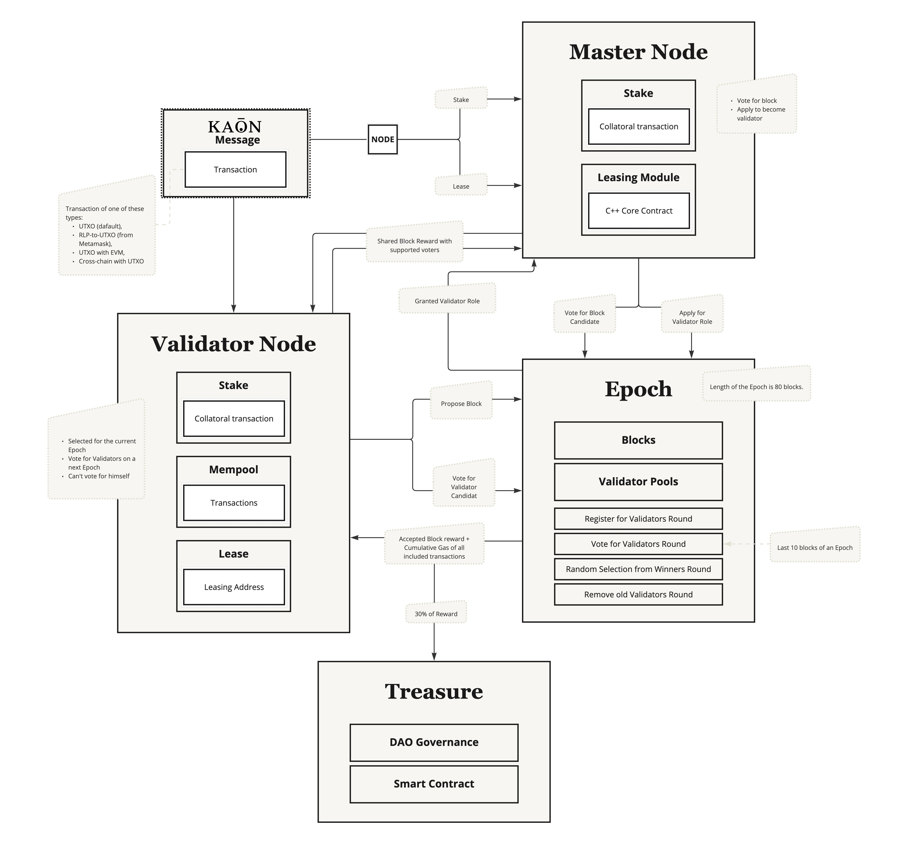
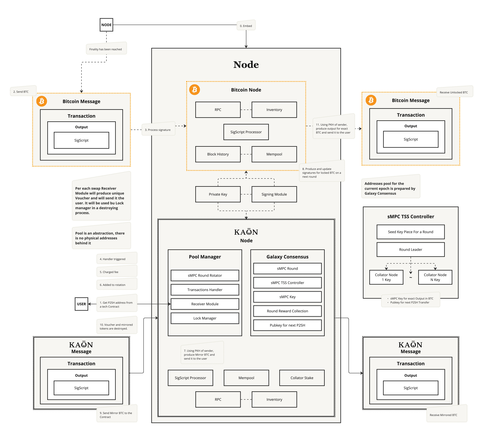
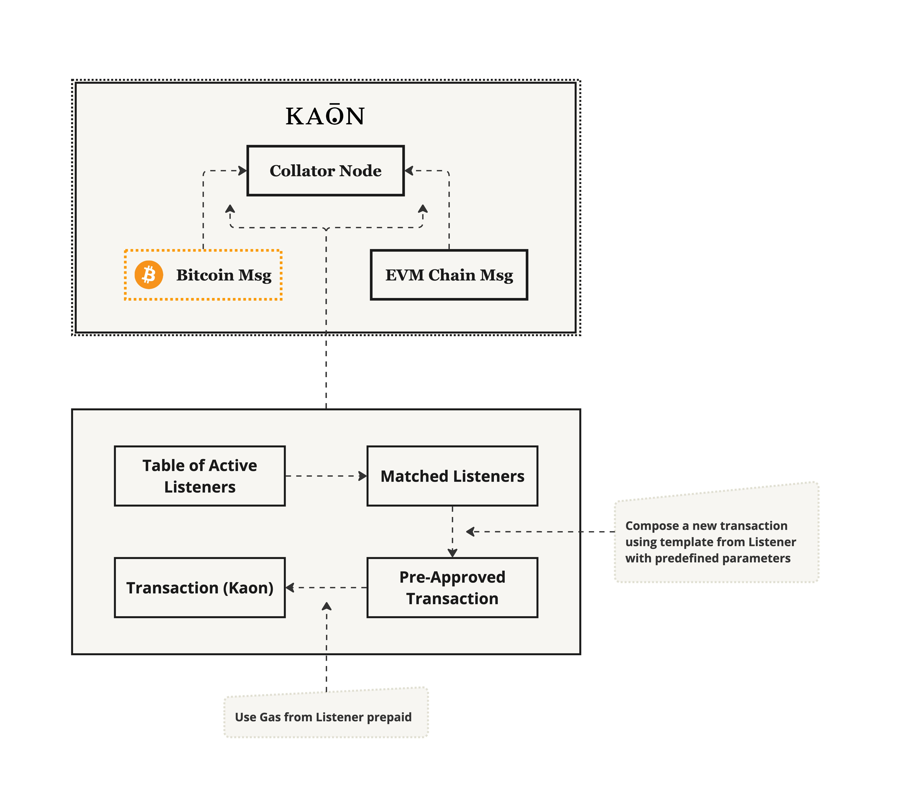
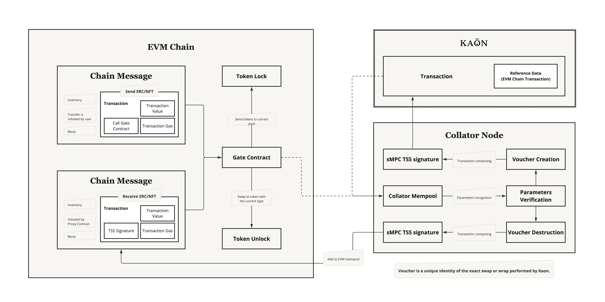
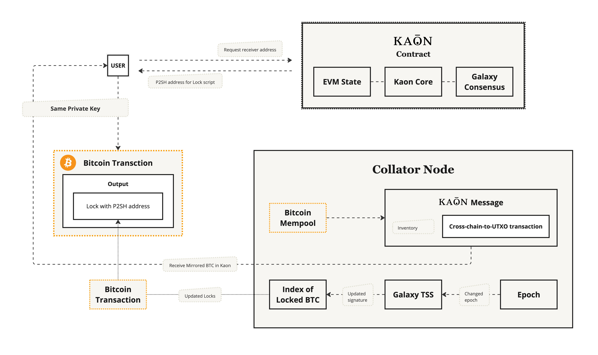
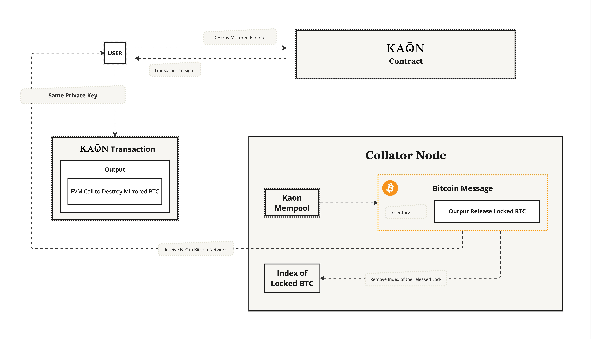
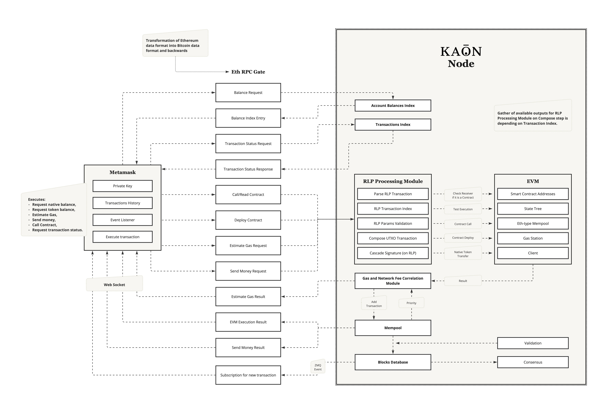
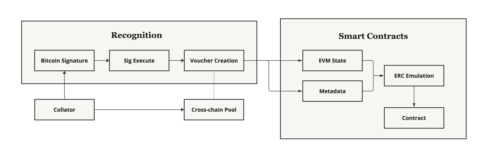
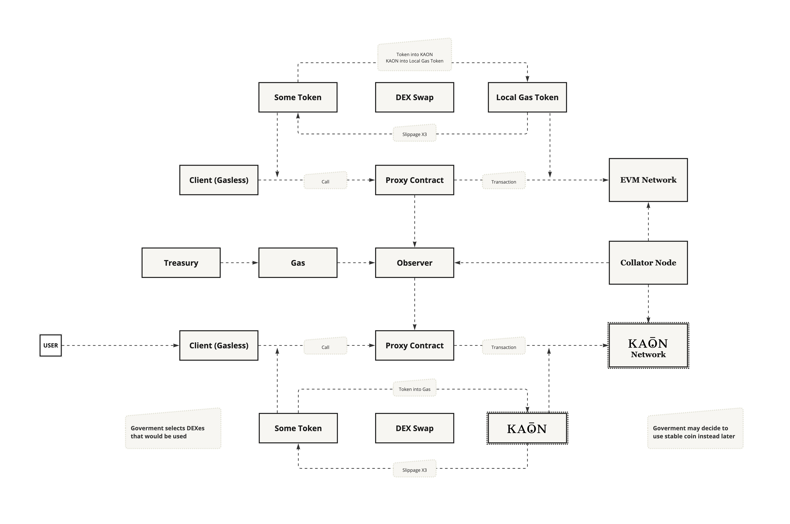
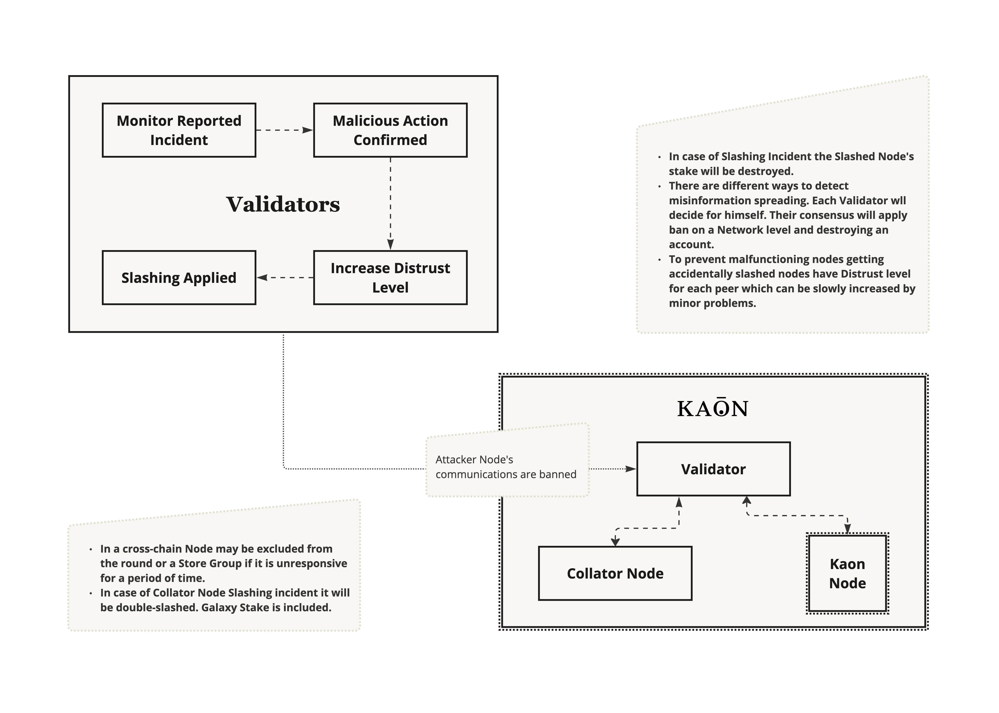

# Technical Architecture [WIP]

# Table of Contents

- [Technical Architecture \[WIP\]](#technical-architecture-wip)
- [Table of Contents](#table-of-contents)
- [Overview](#overview)
  - [What is Kaon?](#what-is-kaon)
  - [How does it work?](#how-does-it-work)
  - [Key Terms](#key-terms)
- [Diagrammes: Key Processes](#diagrammes-key-processes)
  - [Preparation for Launch](#preparation-for-launch)
    - [Kaon Chain Consensus (dPoS)](#kaon-chain-consensus-dpos)
    - [Kaon Cross-Chain Consensus Galaxy](#kaon-cross-chain-consensus-galaxy)
  - [Oracle-less Cross-chain Message Processing Process](#oracle-less-cross-chain-message-processing-process)
  - [Bridge-less ERC Cross-chain Transfers Process](#bridge-less-erc-cross-chain-transfers-process)
    - [The Listeners](#the-listeners)
    - [Locks and Vouchers](#locks-and-vouchers)
    - [Contract-to-Contract Call](#contract-to-contract-call)
  - [BTC Locking and Mirroring Process](#btc-locking-and-mirroring-process)
  - [BTC Withdrawal Process](#btc-withdrawal-process)
  - [Mirrored BTC And EVM Interactions Process](#mirrored-btc-and-evm-interactions-process)
  - [Metamask and other Offchain EVM Wallets Support Process](#metamask-and-other-offchain-evm-wallets-support-process)
  - [Mirrored BTC Transfer To EVM Chain Process](#mirrored-btc-transfer-to-evm-chain-process)
  - [Restore Mirror BTC From Wrap Process](#restore-mirror-btc-from-wrap-process)
  - [Gasless Operating Process](#gasless-operating-process)
  - [Operator Set Changes Process](#operator-set-changes-process)
  - [Slashing Incidence Process](#slashing-incidence-process)
- [Development](#development)
  - [EVM Smart Contracts](#evm-smart-contracts)
  - [Bitcoin Sigscript](#bitcoin-sigscript)
  - [BitVM Support](#bitvm-support)
  - [Bitcoin Rust Support](#bitcoin-rust-support)
  - [Bitcoin RPC / Ordinals API](#bitcoin-rpc--ordinals-api)
  - [Ethereum Gate API](#ethereum-gate-api)
- [Key Innovations](#key-innovations)

# Overview

This document serves as a comprehensive guide to understanding the underlying design and structure of Kaon. It is intended to provide a clear and detailed description of the internal processes, components, and technologies that make up the chain. This document will be an essential resource for developers, validators, and anyone involved in the project, offering insight into the Kaon’s architecture and how all the pieces fit together. Please feel free to reach out to the team if you have any questions or concerns.

## What is Kaon?

Kaon proposes leveraging an L1 chain being a foundational blockchain network upon which other protocols and applications are built such as Bitcoin, Etherum, etc. Kaon leverages an L1 chain with an open architecture as a transfer provider, offering several key capabilities that address the existing challenges in the blockchain ecosystem. This innovative approach begins with platform flexibility in that users can access any trading platform on an EVM-compatible BTC side chain, which means they can directly purchase BTC using popular wallets, e.g., MetaMask. Once purchased, these users can send BTC to their Bitcoin wallet through specific OP_CODEs or smart contract addresses, simplifying the transaction process and making it more user-friendly. Furthermore, the use of an L1 chain with an open architecture ensures both transparency and security. This architecture allows every transaction to be openly verified on the blockchain, reducing the risk of fraud and increasing trust among users.  Integration with Bitcoin is another significant capability of Kaon. By spreading nodes publicly and allowing anyone to become a validator, Kaon maintains its identity within the Bitcoin family.  Kaon operates as a BTC side chain, based on the Bitcoin transaction model while offering full Ethereum Virtual Machine (EVM) support. 
The platform also utilizes a UTXO chain with merge compilation, capable of merging Bitcoin Core C++ and Kaon Core C++ into a single binary. This innovation allows nodes to operate simultaneously in both chains, ensuring cross-verification with the same private keys and multiple validators maintaining operations, thus enhancing security and reliability.

## How does it work?

At its core, Kaon uses Bitcoin Core code, a dPoS consensus and Galaxy consensus for a cross-chain. It also leverages the Evmone module to introduce complete EVM and solidity smart contracts for BTC ecosystem.

## Key Terms

Before diving into the technical architecture of Kaon, it is essential to understand a few terms that will frequently appear:
- **$KAON**: The native coin on the Kaon blockchain.
- **Mirrored BTC**: A digital twin of Bitcoin (BTC) sent to the Kaon blockchain. For more details, refer to the "BTC Locking and Mirroring Process" section.
- **Wrapped BTC**: Minted by destroying Mirrored BTC on Kaon, this is an ERC20 token. While the ability to trace the exact BTC in the process is lost, the token can be transferred to other chains. Note that tracing from the Mirrored BTC to the original BTC in the Bitcoin Network is not possible with ERC20 tokens.
- **Cross-chain Validators (Collators)**: These are established Bitcoin miners, node holders, validators, or node holders of any other integrated chain. They run an embedded node from the target chain within the Kaon node. Randomly selected validators participate in the Secure Multi-Party Computation (sMPC) key generation ceremony per epoch for all the signatures used within the chain to generate token locks.
- **Voucher**: A system record that identifies exact mirroring events, represented as a Non-Fungible Token (NFT). It is a part of the Mirrored BTC.
- **Inventory**: A special type of transport container commonly used in classic blockchains to transfer data about blocks and transactions from peer to peer.

# Diagrammes: Key Processes

The following diagrammes for each process provide a visual representation of Kaon’s data flow. These visual aids are designed to enhance the understanding of Kaon’s technical architecture by simplifying complex concepts and illustrating how it works at its core.

## Preparation for Launch

At launch:
1. **Validator Nodes:**
    - Kaon begins with 25 validator nodes.
    - At least 10 of these nodes must be Collator Nodes with Bitcoin integration to work with the Bitcoin Network.

2. **Master Node:**
    - Each node must stake KAON tokens and create a collateral transaction to become a Master Node.
    - The required amount of tokens to be staked is dependent on the chain height (the number of confirmed blocks in the chain).

3. **Validator:**
    - Entities that stake and lease KAON tokens, optionally running an embedded hot node of Bitcoin or any other integrated chain along with the Kaon node.
    - Validators have the ability to produce new blocks, receive rewards, and collect gas fees from transactions added to a block.
    - At the start of the Epoch, they must apply to become Validators and pass a public vote.
    - The Master Node must have a leased amount to its address using the special core functionality called the Leasing Manager.

4. **Collator Node (Not Active):**
    - To interact with Bitcoin, at least 10 nodes need to embed the latest release of Bitcoin Core into the Kaon Node and perform a standard Bitcoin Node setup and sync.

5. **Cross-chain Validator or Collator Node:**
    - After embedding Bitcoin Core, these nodes must be added to the Store Groups of Galaxy to participate in sMPC (secure Multi-Party Computation) rounds.
    - To do this, they must stake an additional amount of KAON tokens in the Galaxy consensus to become a Collator Node or a Cross-chain Validator.
    - The exact amount to be staked is governed by the chain consensus, similar to how gas limits and gas prices are managed by consensus.

### Kaon Chain Consensus (dPoS)

Kaon Chain employs a Delegated Proof of Stake (dPoS) consensus mechanism, a Bitcoin-family consensus model based on stakes and delegates. This forms a two-level network comprising Master Nodes, Validators, and other nodes. Our implementation extends the traditional model to manage whitelists for Galaxy consensus.

1. **Epochs and Super-Cycles**: 
   - An Epoch consists of 80 blocks (this number is subject to change).
   - Kaon uses Epochs and super-cycles to structure its blockchain operations.
2. **Master Nodes and Validator Candidates**:
   - Master Nodes can apply to become Validator Candidates starting from block 0 of the Epoch up to block 69.
   - From block 70 to block 80, current Validators vote for Validator Candidates for the next round of validators.
   - A Validator cannot apply to be a Validator Candidate and cannot be voted for during the Public Vote step.
3. **Validator Rotation**:
   - At the end of each Epoch, there is a rotation of validators.
   - Old validators are removed from the Validators Pool.
   - New Validators are randomly selected from the top-voted candidates of the Voting step.
4. **Reward Distribution**:
   - The consensus mechanism is responsible for distributing rewards.
   - The reward for a block consists of two parts:
     - A base part, which depends on the block height (Kaon has a modified halving algorithm).
     - The cumulative spent gas of all transactions included in the block.
5. **Recipients of Rewards**:
   - The Validator who proposed the accepted block.
   - Master Nodes that voted by placing their stakes on the block.
   - 30% of the reward is allocated to the Treasury.

### Kaon Cross-Chain Consensus Galaxy

Galaxy is a cross-chain consensus mechanism based on Store Groups, Shamir polynomials, and the composition of one-time TSS (Threshold Signature Scheme) signatures per each round. It is utilized by Kaon in a cross-chain context and is managed by the chain’s dPoS (Delegated Proof of Stake).

1. The user calls a view function no on the Kaon contract to obtain an address for the P2SH (Pay-to-Script-Hash) lock script on the Bitcoin Network from the current round of sMPC (Secure Multi-Party Computation). This contract also provides the current fee for transfer-type transactions.
2. The user locks BTC (Bitcoin) using the retrieved address.
3. The Bitcoin node processes the signature of the output from the UTXO (Unspent Transaction Output) transaction sent by the user.
4. Collator Nodes, part of the Bitcoin Network, will also process this signature. If they identify a valid signature, the Transaction Handler on the Kaon side of the node will be triggered.
5. The fee for the transfer will be deducted from the base transaction value. If the fee is insufficient, the transaction will be ignored until the user sends an additional amount of BTC.
6. The fee will be distributed among the validators who processed the current sMPC round.
7. The received output will be added to the Lock Manager, which will update its lock script according to sMPC round updates.
8. Based on the transaction sender, Mirror BTC (with the fee deducted) will be produced on the Kaon Network, with the sender as the owner. A special token voucher, similar to an NFT (Non-Fungible Token), will be issued to the sender as an identifier of the token.
**Managing Lock Script**
8. At the end of the sMPC round, the Lock Manager may produce an updated P2SH lock script for some of the locked outputs.
**Reversing the Process (Returning BTC to the Bitcoin Network):**
9. The user sends their Mirrored BTCs to the contract.
10. Recognition and validation processes are initiated. If successful, the voucher and Mirrored BTC will be destroyed.
11. On the Bitcoin node side, a P2PKH (Pay-to-PubKey-Hash) type transaction will be composed and signed, with the user as the receiver, allowing them to retrieve their locked BTC.

## Oracle-less Cross-chain Message Processing Process

The relay process in Kaon's cross-chain messaging does not utilize oracles, as the responsible nodes are legitimate parts of another chain. These nodes bear the responsibility for the process, and they manage fees and rewards within the dPoS and Galaxy consensus.

This process leverages threshold signatures from the current round, where consensus is achieved when the transaction is signed by the required number of actors.

   - The process includes Store Groups with Cross-chain Validators (Collator Nodes), formed based on a whitelist provided by dPoS Epoch Validators. Each round, a slot leader is selected.
   - For a transaction to be processed across chains, it must reach maturity as defined by the connected network’s parameters, which ensures the transaction is irreversible.
   - If a transaction is rejected at any stage before reaching maturity, it is returned to the sender.

1. **Slot Leader Selection:**
   - (`DbInit`) Ensures all necessary data structures and storage are prepared before any consensus-related activities begin.
   - (`initSma`) The core function is multi-step process involves :
    1) **Random Genesis Generation:**
        - Utilizes a deterministic approach by hashing a predefined input to establish the initial set of values used in leader selection.
    2) **Epoch Leader Retrieval:**
        - Fetches the leaders of the genesis epoch from a precompiled smart contract, which holds the whitelisted addresses allowed to participate in the initial consensus rounds.
    3) **Public Key Mapping:**
        - Maps public keys to their respective leaders based on the retrieved data, setting up the necessary infrastructure for public key infrastructure (PKI) operations within the consensus mechanism.

2. **Commitment Generation:**
   - Each slot leader generates a commitment based on their public key and a shifted version of it (using a predetermined alpha value). These commitments serve as proofs of their participation and integrity in the consensus process.

3. **Transaction Broadcasting:**
   - Commitments are then wrapped into transactions and broadcasted to the network. This involves additional activities to form a secure message for broadcast.

## Bridge-less ERC Cross-chain Transfers Process

In Kaon, we have designed a system that facilitates secure and efficient cross-chain transfers without the need for intermediary bridges. This process is managed by a specialized listeners and a set of clearly defined steps.

### The Listeners

- **Monitoring:** The listener continuously monitors incoming messages and transactions.
- **Expected Parameters:** It holds the expected parameters of incoming transactions from the Bitcoin Network or other chains.
- **Lifespan and Gas:** The listener has a defined gas amount that determines its lifespan, which can be refilled as necessary.
- **Triggering:** When triggered, the listener creates a new UTXO transaction in Kaon using parameters from both its creation and the incoming transaction, utilizing its stored gas as the transaction fee.

### Locks and Vouchers

- **Collator Mempool:** The new EVM transaction is added to the EVM chain part’s mempool by the collator nodes.
- **Triggering the Listener:** The listener is triggered based on parameter recognition and verification.
- **Token Lock Handling:** If the transaction involves a token lock (indicating liquidity entering the chain from outside), a voucher (NFT) is created to identify the exact lock.
- **Token Unlock Handling:** If the transaction involves token unlocking, the corresponding voucher is detected and destroyed.
- **Transaction Composition and Signing:** The transaction is composed and signed using the Threshold Signature Scheme (TSS).
- **ERC Token Exchange:** The voucher is subsequently exchanged for the corresponding ERC tokens.
- **Transaction Acceptance:** The final step ensures the acceptance and validation of the transaction, completing the cross-chain transfer process.

### Contract-to-Contract Call

- Specific message type proxies a call from one smart contract to another smart contract.
- The process works as a chain of calls. A smart contract call is relayed through a transaction to our router (a proxying smart contract that serves as an execution table of tables).
- The initial smart contract call is sent to the router. This router serves as an intermediary that ensures the call is directed to the correct destination.
- Our collator node picks up the transaction from the router. The collator then routes the transaction to the appropriate destination, ensuring the integrity and security of the call.
- The chain of calls is executed in a manner similar to how an ordinary smart contract would function. Each call in the chain is processed sequentially, ensuring that all conditions and parameters are met.

## BTC Locking and Mirroring Process

In Kaon, we anticipate that users may want to utilize BTC in scenarios that are only implementable using Solidity Smart Contracts. To facilitate this, our chain supports a comprehensive BTC locking and mirroring process.

The user makes a view call to the Kaon contract (at address 0x0…1, where addresses 0x0…1 to 0x0…1000 are reserved). It sends a lock script of P2PSH type for users to use it to lock BTC in the Bitcoin Network.

**Message Transactions:**
   - **Output New Lock (P2PSH):** The initial transaction output with a new P2PSH lock script.
   - **Output Updated Lock by Kaon in BTC:** Subsequent transactions update the lock script managed by Kaon in the Bitcoin network.
   - **Output BRC/ERC New Record in Kaon:** A new record is created in Kaon’s transaction history, involving an Inventory container to spread information throughout the chain.

**Voucher Creation:**
   - A voucher (similar to an NFT) is issued, identifying the exact lock and linking it to the user’s transaction.
   - The user’s voucher tokens are managed and utilized as part of the locking and mirroring process.

**Mirroring process:**
   - The user makes a view call to the reserved Kaon contract address.
   - The user initiates a request to lock BTC using a specialized P2PSH script.
   - Initial and subsequent transactions manage the lock script on the Bitcoin network.
   - A voucher is issued to represent the locked BTC.

## BTC Withdrawal Process

   1. User sends tokens to the contract where they initially received the P2PSH lock.
   2. Ensure the sender is the native BTC sender.
   3. If using a MetaMask address, specify the receiver; otherwise, the transaction will be rejected.
   4. A P2PKH output is created.
   5. The BTC is sent back to the user through a TSS signed transaction, completing the withdrawal process.
   6. Contract verifies the voucher and then destroys it to prevent reuse.

## Mirrored BTC And EVM Interactions Process

It is crucial to understand the unique properties of Mirrored BTC (mBTC), it is basically dual-record token, where BRC standard token part keep transaction records for specific tokens, while ERC metadata facilitates interaction with EVM smart contracts.

1. The user sends Mirrored BTC to a designated smart contract.
2. The transaction first enters the BRC20 section, where the Mirrored BTC verifies its data and balance.
3. After verification, the transaction transitions to the EVM state.
4. Predefined ERC token metadata is injected at this stage.
5. The EVM state executes its standard methods, which are masked calls to the BRC/EVM processor that actually handles the responses.
6. This forms EVM state updates, including updates to the EVM store and the transactions Merkle Tree.
5. After verification by the BRC/ERC processor, the state updates produce UTXO sub-transactions, which are submitted to the mempool (essentially, they are appended to the end of the block during its composition).
6. Once the block is verified and accepted locally, it is spread across the entire blockchain network using an inventory system.

## Metamask and other Offchain EVM Wallets Support Process

When a user sends a request from MetaMask or another EVM wallet, it undergoes a transformation process to ensure compatibility with the Kaon ecosystem:
- **Eth RPC Gate:** Transforms EVM wallet requests into Bitcoin RPC 1.26 type requests and sends them to the Kaon Node. It may also compose additional information as needed. Also it provides transaction information in Ethereum format, ensuring compatibility and ease of use for MetaMask and other EVM wallets.
- **WebSockets Subscriptions:** Provides WebSockets subscriptions for new events by wrapping ZMQ events from the Kaon node.

**Support and Processing:**
- **Account Balance and Transaction Indexing:** Each Kaon Masternode has the Account Balance Index and Transaction Index turned on to support balance requests and transaction composition based on RLP (Recursive Length Prefix) data.
- **RLP Processing Module:** For RLP-type requests (sendrawtransaction calls such as sending money, deploying contracts, and executing contract methods), Kaon:
  1. Decodes the input.
  2. Validates the input and its parameters.
  3. Composes a UTXO transaction based on the input.
  4. Signs the transaction using Cascade Signature with the input RLP transaction as its basis.
- **Denomination Handling:** Despite being a Bitcoin fork, Kaon supports a denomination with 18 zeros for the native token to align with EVM standards.
- **Complete EVM Integration:** Kaon includes a complete EVM as part of its core.
- **Unified Gas Fees:** Kaon composes gas fees and network bitcoin-type fees (based on priorities) to present a single gas fee to the user, making it hidden from the user.
- **Gas Price and Transaction Estimation:** Methods for current gas price and gas transaction estimation work seamlessly to support EVM wallets.

## Mirrored BTC Transfer To EVM Chain Process

1. The transfer process is initiated by the user.
2. Upon recognition of the transfer, the Mirrored BTC is moved to the network’s storage. This storage is part of the cross-chain pool that manages the creation of new vouchers for cross-chain transactions.
3. The cross-chain pool storage creates new vouchers to represent the Mirrored BTC tokens.
4. The special BRC/ERC Mirrored BTC tokens are transformed into simple ERC20 tokens because other chains do not support the Bitcoin UTXO paradigm. Maintaining the UTXO model on these chains is impossible.
5. New ERC20 tokens are issued on the target EVM chain, representing the transformed Mirrored BTC. These tokens adhere to the ERC20 standard, ensuring compatibility with the EVM chain’s infrastructure.

Although the UTXO model is not supported on EVM chains, the transformation process can be reversed using Voucher produced by this transformation.

## Restore Mirror BTC From Wrap Process

1. The user initiates the process by sending the ERC20 tokens (which represent the wrapped Mirrored BTC) to a designated smart contract on the Kaon chain.
2. The smart contract recognizes the transaction and identifies the corresponding voucher created during the initial wrapping process. This voucher contains the necessary details to facilitate the restoration.
3. The voucher undergoes a validation process to ensure its authenticity and to confirm that it matches the ERC20 tokens being unwrapped.
4. Upon successful validation, the voucher is destroyed. This step is crucial to prevent any double-spending or reuse of the voucher.
5. The details from the destroyed voucher are used to trigger the creation of Mirrored BTC tokens back on the Kaon network.
6. The Kaon network mints new Mirrored BTC tokens equivalent to the amount specified in the destroyed voucher. This step ensures that the user regains their original token value in the form of Mirrored BTC.
7. The newly minted Mirrored BTC tokens are sent to the user’s wallet within the Kaon network, completing the restoration process.

It is possible to do the reverse without using Voucher and using only tokens. But this way Kaon pool will assign Bitcoins randomly and only from those who are received from unrecognized sources.

## Gasless Operating Process

1. The user initiates a transaction to transfer some tokens without holding the native gas token for transaction fees.
2. A portion of the transaction fee is paid using the tokens being transferred. In this case, some tokens are converted to Kaon tokens.   
5. This gasless mechanism acts as a universal means for transaction fee management, making it possible to conduct transactions across different chains without needing the native gas token. This can later be adapted to use a stablecoin for even more stability and predictability.
6. The system accounts for slippage up to three times (Slippage X3) to ensure the transaction’s success.

The gasless mechanism is designed to work across various blockchain networks, with Observers being introduced.

## Operator Set Changes Process

- **Decentralization:** The validator set is managed in a decentralized manner, eliminating the need for additional actions when validators change.
- **Open Participation:** Any eligible participant can join the validators' pool without restrictions, ensuring a diverse and resilient validator set.
- **Cold Staking:** Participants can opt for cold staking, which allows them to stake tokens without having them online.
- **Dynamic Validation:** The validator set can dynamically adjust to changes in validator participation, such as new validators joining or existing validators leaving.
- **Galaxy Consensus Role:** The Galaxy consensus mechanism works in tandem with the dPoS framework to validate transactions and produce blocks. 

## Slashing Incidence Process

1. **Incident Detection and Reporting:**
   - **Block Not Accepted:** When a block proposed by a validator is not accepted, it triggers a report node mechanism.
     - **Validator Reporting:** Validators report the invalid block (inv) or invalid transactions (inv) associated with the block.
     - **Consensus Mechanism:** The consensus mechanism processes the report and, if validated, the incident is escalated.
   
2. **Increasing Distrust Level:**
   - **Consensus Decision:** The consensus mechanism evaluates the report. If the block or transaction is rejected, the distrust level of the involved validator is increased.
   - **Malicious Behavior Reporting:** Validators can report any malicious actions observed from another validator.
   - **Uptime Monitoring:** Validators continuously monitor each other’s uptime. Lack of uptime or unavailability is also reported.

3. **Validator Response and Exclusion:**
   - **Ping Mechanism:** Validators and master nodes periodically ping each other to check for responsiveness.
     - **No Reaction:** If a validator does not respond or is unavailable, this is reported.
     - **Exclusion Decision:** Based on the reports, the consensus mechanism may decide to exclude the unresponsive validator from the current round.

4. **Reaching Distrust Maximum:**
   - **Distrust Level Monitoring:** The distrust level of each validator is continuously monitored.
   - **Slashing Decision:** If a validator’s distrust level reaches the maximum threshold, a slashing decision is made through the consensus mechanism.

5. **Executing Slashing:**
   - **Consensus Approval:** The consensus mechanism must approve the slashing decision. This involves validating the accumulated reports and ensuring that due process has been followed.
   - **Validator Slashing:** Once approved, the validator is slashed. This may involve:
     - **Token Penalties:** The validator’s staked tokens are partially or fully burnt.
     - **Exclusion:** The validator is excluded from the network. Every member of the chain won’t accept any information from the slashed validator. Validator’s address won’t be accepted anymore in a transaction validation process.

# Development

## EVM Smart Contracts

Kaon's node EVM offers comprehensive support without zero-knowledge (ZK) functionalities, adhering to adjusted gas price policies. The gas limit is managed by validator consensus, ensuring fair and efficient network operation.

## Bitcoin Sigscript

Kaon is part of the Bitcoin family, fully supporting Bitcoin sigscript for its native transactions. It incorporates a few additional OP_CODEs for internal use while strictly following the Bitcoin GitHub repository. Kaon does not include unconfirmed OP_CODEs from pull requests and discussions, with rare exceptions for essential updates.

## BitVM Support

Kaon supports [Tree++](https://bitvm.org/treeplusplus.html) and will continue to follow its updates. This ensures that Kaon remains compatible with advanced scripting capabilities and the evolving BitVM ecosystem.

## Bitcoin Rust Support

Kaon has forked and adapted the bitcoin-rust library, making core parameters current and functional. The adapted version is shared for community use and further development.

## Bitcoin RPC / Ordinals API

Kaon provides `kaon-cli` and `kaond` RPC interfaces based on the Bitcoin 1.26 RPC standard, with additional methods to support enhanced functionalities. A demonstration API for Ordinals and BRC20 is also available, showcasing the integration and usage of these features within the Kaon network.

## Ethereum Gate API

Users have the capability to interact with the Ethereum network via the Ethereum Gate API, facilitating seamless cross-chain communication and asset management.

# Key Innovations

Kaon introduces several groundbreaking changes that differentiate this system apart from other existing blockchain platforms:

1. **mirrorBTC:** This feature ensures mirrored token interactions are genuinely connected to the original BTC, addressing trust and security issues associated with wrapped BTC. It is built using BRC20-alike approach with a basis transaction, and has predefined metadata and handlers enabling EVM to interact with them just like it does with smart contracts.
2. **UTXO-EVM Combination:** Allows seamless interaction with inscriptions, ordinals, BRC20, and runes from smart contracts, bridging the gap between UTXO and EVM models.
3. **RLP Transaction Support:** Enables seamless integration with Metamask and other Ethereum-based tools, a unique feature among UTXO chains, based on Onion (Cascade) signature concept.
4. **1e-18 Denomination:** Offers 10 times less expensive gas fees and complete EVM support, surpassing the traditional 1e-8 BTC denomination. All compress and encode algorithms are updated accordingly in order to reduce excessive zeros in a database as much as possible.
5. **RPC Ethereum Full Support (geth client type):** UTXO transactions are parsed as standard Ethereum transactions, ensuring compatibility with Ethereum tools like Blockscout.
6. **Cross-Contracts:** Facilitates smart contract interactions across different chains, simplifying the creation of cross-chain NFTs, stablecoins, and dApps.
7. **Observers:** Introduces a subscription model for dApps to back-spread specific events from other chains, enhancing user experience and possible interaction complexity.
8. **Control over Pools by the Chain:** Ensures liquidity pools for swaps are managed by the chain, enhancing security and trust. Ensures non-custodial nature of the pool in Bitcoin-family chains.
9. **Merge of Nodes:** Combines nodes from different chains to operate as a single entity (or binary), eliminating the need for oracles in cross-chain interactions.
10. **Same Private Keys as in BTC:** Allows users to sign transactions in both chains with the same wallet, leveraging account abstraction with BTC.

These innovations collectively position Kaon as a versatile and forward-thinking dApp capable of creating entirely new financial strategies.
